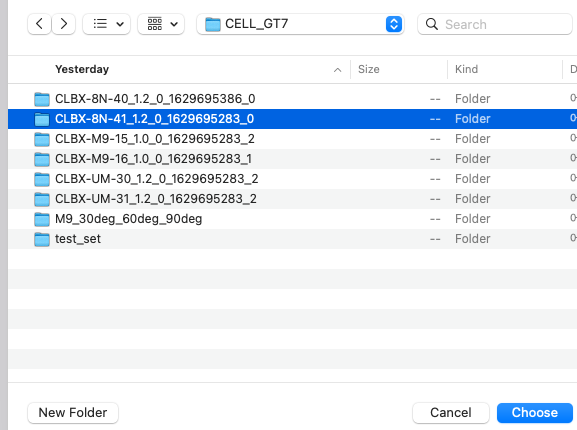
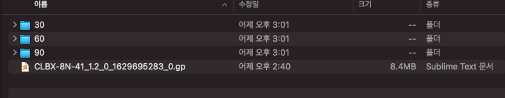
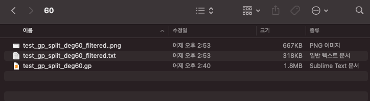
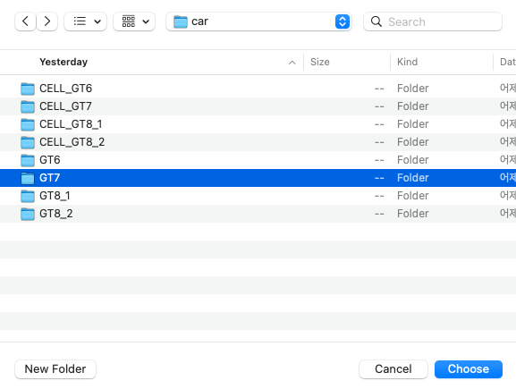
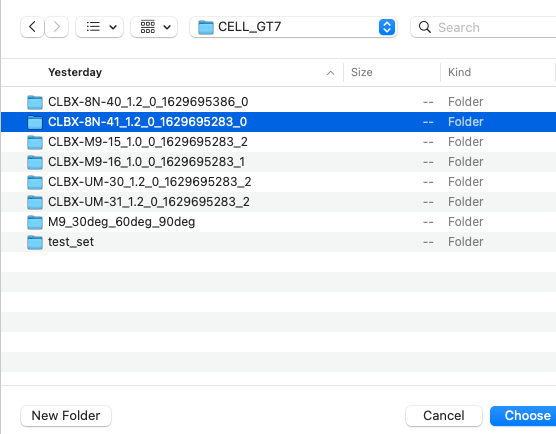
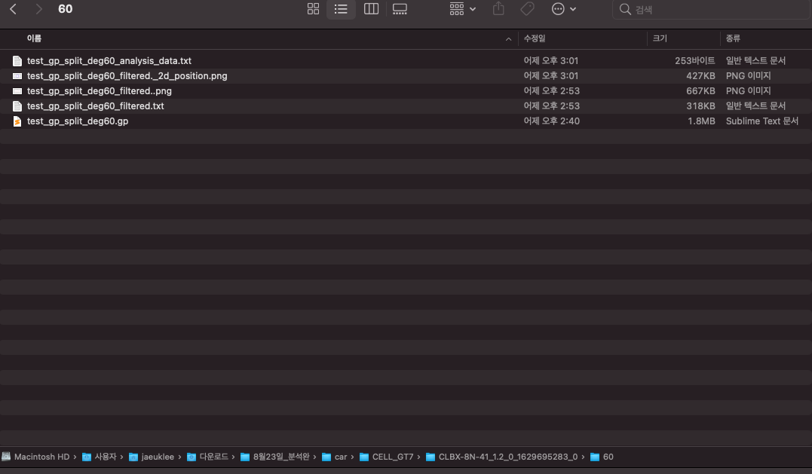

## Python-NMEA-data-analysis

### 1) 개발환경 설정

micropyGPS ( https://github.com/inmcm/micropyGPS ) 라는 reop의 파싱 API를 사용하였기 때문에
관련 설치를 진행해야한다.

또는

폴더 안의 venv/ 를 활용하여 인터프리터를 설정해주면 별도의 설치 없이 진행이 가능하다.

```
python setup.py install
```

------------

### 2) 사용 방법

####  ------------------------------------------------------- [ Step 1  : 시간과 각도에 따라 데이터 파일을 나누어주기 ] -------------------------------------------------------


1. **각각의 파일 하나에 하나의 폴더 만들어 주기**

    처음 .ubx / .gp 파일을 적절하게 폴더명을 붙여서 만든다. (모든 것은 폴더 기준으로 경로를 선택함)
    ex) 파일명 : CLBX-8N-41_1.2_0_1629695283_0.gp
        폴더명 : CLBX-8N-41_1.2_0_1629695283_0
    
    현재 폴더 안에는 .ubx(GT) 나 .gp 파일이 하나만 있는 상태

<br/>
<br/>

2. **코드의 시간 및 각도 기록 후 코드 실행**
    <span style="color:red">NMEA_cell_gp_split_file_by_time.py</span>
     의 코드에서 
    ```python
    # 각각 30, 60, 90 도
    time_divide_by_deg = ["005920.00,010350.00",
                          "164800.00,165500.00",
                          "165800.00,170500.00"]
    
    degree_list = ["0", "30", "60"]
    }
    ```
   
    의 형식을 따라서 나누고자 하는 파일의 시간과 각도를 각각 수정한다.

<br/>
<br/>

3. **코드 실행**

코드를 실행하면 선택을 할 수 있는 창이 실행되고 거기서 시간이 나눠지길 원하는 폴더(파일x)를 choose(open).




코드가 잘 실행 된다면, 아래의 결과처럼 폴더(각도)가 자동으로 생성되고 안에 각 각도에 맞는 시간이 split 되어서 저장된다



<br/>
<br/>
<br/>


####  ------------------------------------------------------- [ Step 2 : 나누어진 파일의 1D 그래프 및 NMEA 파싱] -------------------------------------------------------
1. **코드의 폴더명(각도) 변경**

    <span style="color:red">main.py</span> 의 코드 중에서 제일 상단에 보면 
    ```python
    folder_degree_name = ['30', "60", "90"]
    #, "30", "60", '90']
    }
    ```
   가 있는데 각 생성된 폴더에 맞춰서 이 각도 또한 변경(위에서는 하나의 파일에서 30, 60, 90도의 각도로 파일이 나눠졌으므로 30, 60, 90 기입) 

<br/>

2. **코드 실행**

   코드를 실행하게 되면 step 1 과 마찬가지로, 폴더를 고를 수 있는 창이 있다. 
   
   역시 폴더를 선택하여 진행하면 각도별로 분석이 진행된다. (예시의 폴더를 선택하면 30/60/90 순서대로 분석이 진행)


코드를 문제 없이 실행하게 되면 아래의 사진처럼 ***1D 그래프(png), NMEA 파싱 데이터(_filtered.txt)*** 파일(각도별)이 출력된다.




<br/>
<br/>
<br/>


####  ------------------------------------------------------- [ Step 3 : GT와 CELL 의 비교 분석] -------------------------------------------------------

1. **코드의 폴더명(각도) 변경**

    <span style="color:red">NMEA_evaluation.py</span> 의 코드 중에서 상단에 보면 main.py와 마찬가지로

    ```python
    # Extract test degree from
    folder_index_list = ['30','60', '90']
    }
    ```
   코드를 비교할 폴더(GT, CELL) 와 각도에 맞게 수정.

   일반적으로 앞의 코드와 다 같도록 수정함.

2. ##### **코드 실행   <span style="color:red"> ( 헷갈리지 않도록 주의 ! ) </span>**

코드를 실행하면 총 두 번의 폴더 선택 화면이 나온다. 

처음에는 비교할 GT 의 폴더를 선택,

두 번째는 비교할 CELL의 폴더를 선택 ***(CELL 폴더의 경우 GT 보다 한 번더 하위 폴로 들어가야함.)***

ex )

  첫 번째



두 번째




잘 실행되었다면 아래의 그림처럼 ***GT / CELL 2D 그래프와 _analysis_data.txt*** 파일이 각도별로 생성된다.



---

### 3) Troubleshooting

1. Step1 에서 시간/각도별 나눠지지 않는 경우.

에러 메세지가 시간이 출력되면 해당 .ubx / .gp 파일에 시간이 없다는 뜻이다.
슬랙 채널에 올린 것처럼 10Hz 로 가다가 5Hz 로 변경되면 지정한 시간이 없어서 split되지 않음.
-> 시간의 0.1 단위를 변경하여 다시 실행.


2. Step2 에서 에러

int ~~ 로 출력되는 에러가 있으면 해당 파일에 pubx 포맷이 없다( 저번에 UM 시리즈 일때 해당)
-> main.py 코드에서 pubx_flag = 0 으로 설정해주면 pubx 대신 이전의 포맷으로 파싱한다.


